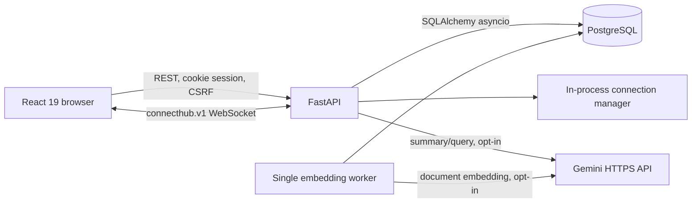

# Overall system architecture

```mermaid
flowchart LR
  U[React 19 browser] -->|REST, cookie session, CSRF| F[FastAPI]
  U <-->|connecthub.v1 WebSocket| F
  F -->|SQLAlchemy asyncio| P[(PostgreSQL)]
  F --> C[In-process connection manager]
  F -->|summary/query, opt-in| G[Gemini HTTPS API]
  W[Single embedding worker] --> P
  W -->|document embedding, opt-in| G
```
