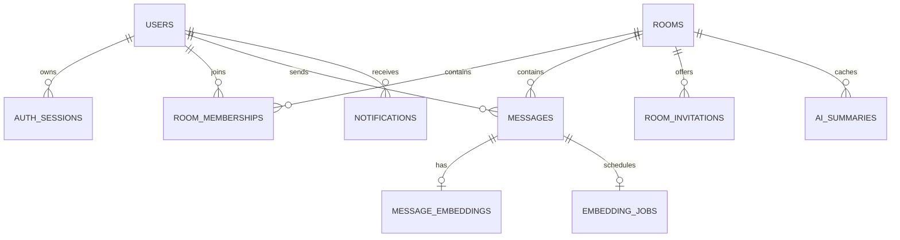

# Database ER diagram

```mermaid
erDiagram
  USERS ||--o{ AUTH_SESSIONS : owns
  USERS ||--o{ ROOM_MEMBERSHIPS : joins
  ROOMS ||--o{ ROOM_MEMBERSHIPS : contains
  ROOMS ||--o{ MESSAGES : contains
  USERS ||--o{ MESSAGES : sends
  ROOMS ||--o{ ROOM_INVITATIONS : offers
  USERS ||--o{ NOTIFICATIONS : receives
  MESSAGES ||--o| MESSAGE_EMBEDDINGS : has
  MESSAGES ||--o| EMBEDDING_JOBS : schedules
  ROOMS ||--o{ AI_SUMMARIES : caches
```

See `database-design.md` and migrations for columns, constraints, and deletion rules.
