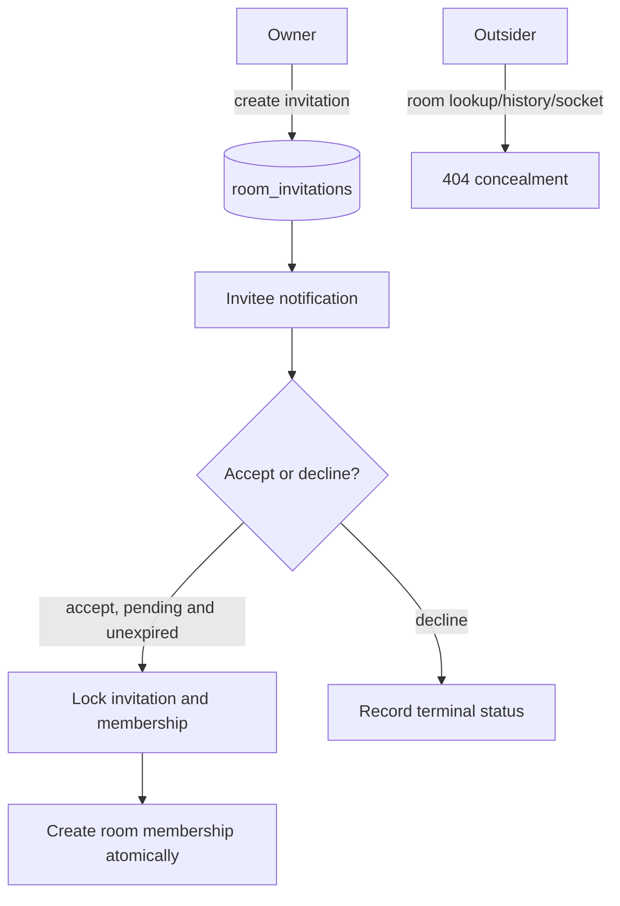

# Private-room invitation and authorization

```mermaid
flowchart TD
  O[Owner] -->|create invitation| I[(room_invitations)]
  I --> N[Invitee notification]
  N --> A{Accept or decline?}
  A -->|accept, pending and unexpired| L[Lock invitation and membership]
  L --> M[Create room membership atomically]
  A -->|decline| D[Record terminal status]
  X[Outsider] -->|room lookup/history/socket| H[404 concealment]
```
