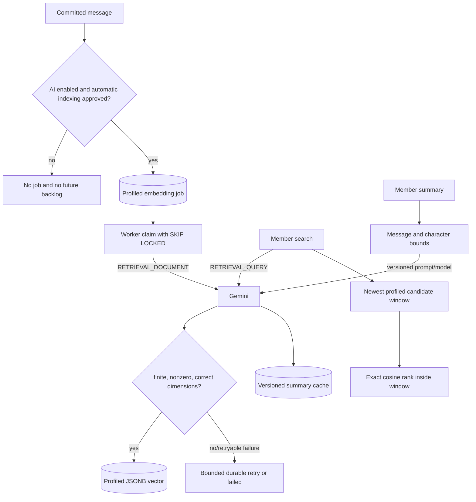

# AI summary and embedding pipeline

```mermaid
flowchart TD
  M[Committed message] --> G{AI enabled and automatic indexing approved?}
  G -->|no| N[No job and no future backlog]
  G -->|yes| J[(Profiled embedding job)]
  J --> W[Worker claim with SKIP LOCKED]
  W -->|RETRIEVAL_DOCUMENT| P[Gemini]
  P --> V{finite, nonzero, correct dimensions?}
  V -->|yes| E[(Profiled JSONB vector)]
  V -->|no/retryable failure| R[Bounded durable retry or failed]
  Q[Member search] -->|RETRIEVAL_QUERY| P
  Q --> C[Newest profiled candidate window]
  C --> S[Exact cosine rank inside window]
  H[Member summary] --> B[Message and character bounds]
  B -->|versioned prompt/model| P
  P --> K[(Versioned summary cache)]
```
