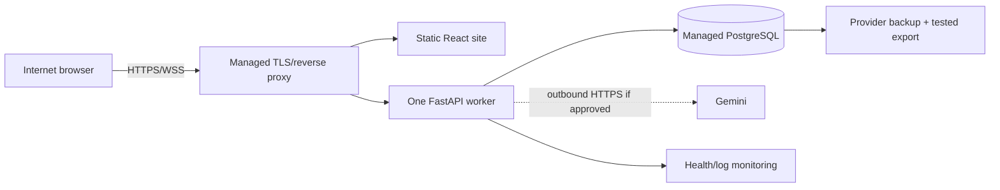

# Proposed controlled-staging deployment

```mermaid
flowchart LR
  I[Internet browser] -->|HTTPS/WSS| T[Managed TLS/reverse proxy]
  T --> S[Static React site]
  T --> A[One FastAPI worker]
  A --> P[(Managed PostgreSQL)]
  A -. outbound HTTPS if approved .-> G[Gemini]
  P --> B[Provider backup + tested export]
  A --> O[Health/log monitoring]
```

This is proposed, not deployed. One worker is mandatory until broadcast, presence, and rate limits have shared coordination.
